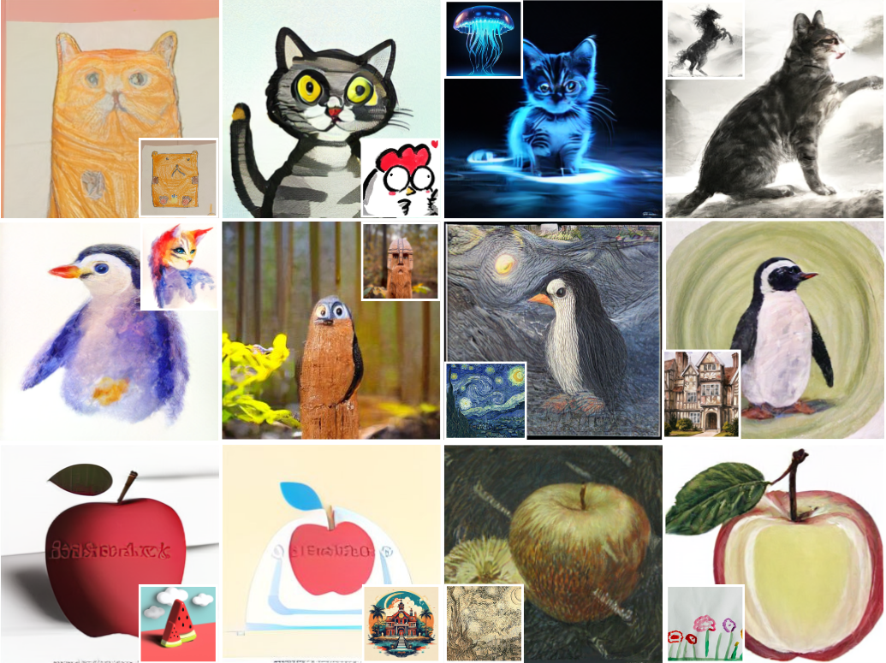
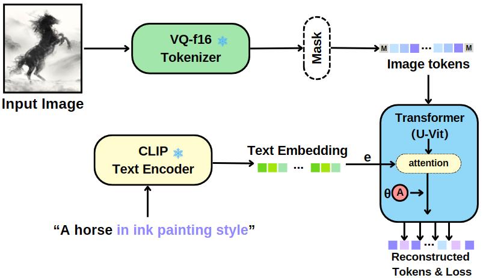
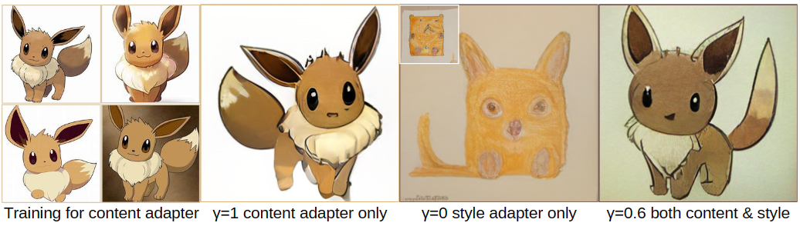
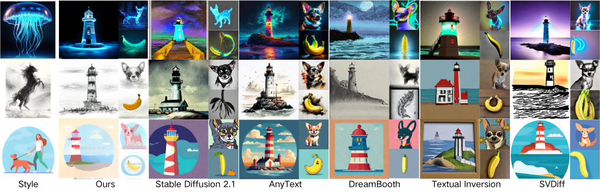

# StyleDrop

<p align="left">
  <a href="https://colab.research.google.com/github/neild0/StyleDrop-PyTorch-Interactive/blob/main/styledrop_colab.ipynb"></a> I didn't modify the colab demo. (NEED large RAM, my free colab can't run it)

</p>


This is an unofficial PyTorch implementation of [StyleDrop: Text-to-Image Generation in Any Style](https://arxiv.org/abs/2306.00983).


Unlike the parameters in the paper in (Round 1), we set $\lambda_A=2.0$, $\lambda_B=5.0$ and `d_prj=32`, `is_shared=False`, which we found work better, these hyperparameters can be seen in `configs/custom.py`.

we release them to facilitate community research.

**Since we also use it for CS182 Final Project, we run more styles and add content-adapter to it.**



<br/><br/>


Note: RAM > 16G


## Data & Weights Preparation

Frozen pre-trained model download.
- VQGAN from this [link](https://drive.google.com/file/d/13S_unB87n6KKuuMdyMnyExW0G1kplTbP/view) 
- checkpoints from this [link](https://huggingface.co/nzl-thu/MUSE/tree/main/assets/ckpts)
- empty_feature by runnig command `python extract_empty_feature.py`(already has one)

And the final directory structure is as follows:
```
.
├── assets
│   ├── ckpts
│   │   ├── cc3m-285000.ckpt
│   │   │   ├── lr_scheduler.pth
│   │   │   ├── nnet_ema.pth
│   │   │   ├── nnet.pth
│   │   │   ├── optimizer.pth
│   │   │   └── step.pth
│   │   └── imagenet256-450000.ckpt
│   │       ├── lr_scheduler.pth
│   │       ├── nnet_ema.pth
│   │       ├── nnet.pth
│   │       ├── optimizer.pth
│   │       └── step.pth
│   ├── fid_stats
│   │   ├── fid_stats_cc3m_val.npz
│   │   └── fid_stats_imagenet256_guided_diffusion.npz
|   ├── contexts
│   │   └── empty_context.npy
└── └── vqgan_jax_strongaug.ckpt

```

## python environment on windows
windows  —— **py310**

```shell
pip install torch torchvision torchaudio --index-url https://download.pytorch.org/whl/cu118

pip install accelerate==0.12.0 absl-py ml_collections einops wandb ftfy==6.1.1 transformers==4.23.1 loguru webdataset==0.2.5 gradio

pip3 install -U xformers --index-url https://download.pytorch.org/whl/cu118
```

triton for windows can be download for the following link:

[r4ziel/xformers_pre_built at main (huggingface.co)](https://huggingface.co/r4ziel/xformers_pre_built/tree/main)

`pip install triton-2.0.0-cp310-cp310-win_amd64.whl`

clip:

[open-clip-torch · PyPI](https://pypi.org/project/open-clip-torch/)

`pip install open-clip-torch`

`pip install numpy scipy omegaconf`


## Train
All style data in the paper are placed in the data directory

1. Modify `data/one_style.json` (It should be noted that `one_style.json` and `style data` must be in the same directory), The format is `file_name:[object,style]`

```json
{"image_03_05.jpg":["A bear","in kid crayon drawing style"]}
```
2. https://wandb.ai/site    Login

3. Training script as follows.
```shell
#!/bin/bash
unset EVAL_CKPT
unset ADAPTER
export OUTPUT_DIR="output_dir/for/this/experiment"
accelerate launch --num_processes 8 --mixed_precision fp16 train_t2i_custom_v2.py --config=configs/custom.py
```

## Inference (I didn't use it)

The pretrained style_adapter weights can be downloaded from [🤗 Hugging Face](https://huggingface.co/zideliu/StyleDrop/tree/main).
```shell
#!/bin/bash
export EVAL_CKPT="assets/ckpts/cc3m-285000.ckpt" 
export ADAPTER="path/to/your/style_adapter"

export OUTPUT_DIR="output/for/this/experiment"

accelerate launch --num_processes 8 --mixed_precision fp16 train_t2i_custom_v2.py --config=configs/custom.py
```


## Visualize demo
Put the [my style_adapter weights](https://huggingface.co/datasets/unpackableorange/StyleDrop-weights/tree/main) in `./style_adapter` folder and run the following command will launch the demo:

```shell
python gradio_visualize.py
```

Note that two adapters can't be none.(use $\gamma$ to adjust)

## Method


## Content adapter
Intergrate style and content adapters.



## Comparison



## Citation
```shell
@article{sohn2023styledrop,
  title={StyleDrop: Text-to-Image Generation in Any Style},
  author={Sohn, Kihyuk and Ruiz, Nataniel and Lee, Kimin and Chin, Daniel Castro and Blok, Irina and Chang, Huiwen and Barber, Jarred and Jiang, Lu and Entis, Glenn and Li, Yuanzhen and others},
  journal={arXiv preprint arXiv:2306.00983},
  year={2023}
}
```

## Acknowlegment

* The implementation is based on [MUSE-PyTorch](https://github.com/baaivision/MUSE-Pytorch)
* My modification is based on [StyleDrop-PyTorch-windows](https://github.com/endman100/StyleDrop-PyTorch-windows/tree/main)


